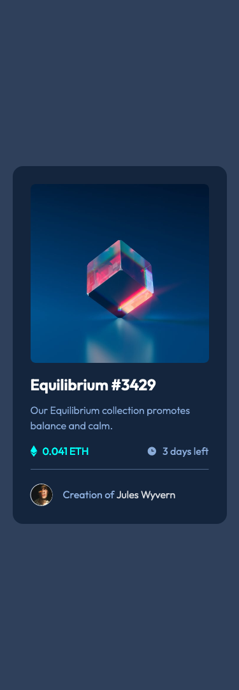
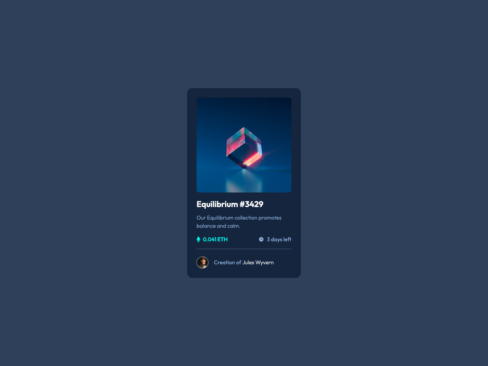
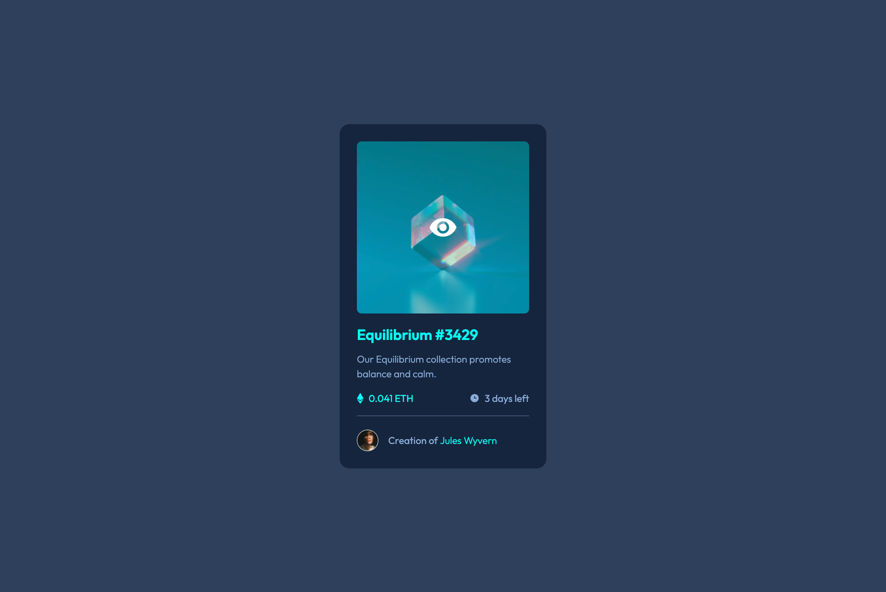

<h1>Frontend Mentor - NFT preview card component solution</h1>

This is a solution to the <a href="https://www.frontendmentor.io/challenges/nft-preview-card-component-SbdUL_w0U">NFT preview card component challenge on Frontend Mentor</a>.

<strong style="font-size: 14px">Frontend Mentor challenges help you improve your coding skills by building realistic projects. </ㄋ>

<h2>Table of contents</h2>

<ul>
  <li>
    <a href="#overview">Overview</a>
    <ul>
      <li><a href="#the-challenge">The challenge</a></li>
      <li><a href="#screenshot">Screenshot</a></li>
      <li><a href="#links">Links</a></li>
    </ul>
  </li>
  <li>
    <a href="#my-process">My process</a>
    <ul>
      <li><a href="#built-with">Built with</a></li>
      <li><a href="#what-i-learned">What I learned</a></li>
      <li><a href="#continued-development">Continued development</a></li>
      <li><a href="#useful-resources">Useful resources</a></li>
    </ul>
  </li>
  <li><a href="#author">Author</a></li>
</ul>

<h2 id="overview">Overview</h2>

<h3 id="the-challenge">The challenge</h3>

<h4>Users should be able to:</h4>
<ul>
  <li>View the optimal layout depending on their device's screen size</li>
  <li>See hover states for interactive elements</li>
</ul>

<h3 id="screenshot">Screenshot</h3>

  
  
  

<h3 id="links">Links</h3>

<ul>
  <li><a href="https://github.com/Beginneraboutlife116/NFT_component-frontend_mentor">Solution URL</a></li>
  <li><a href="https://beginneraboutlife116.github.io/NFT_component-frontend_mentor/">Live Site URL</a></li>
</ul>

<h2 id="my-process">My process</h2>

<h3 id="built-with">Built with</h3>

<ul>
  <li>Semantic HTML5 markup</li>
  <li>BEM className</li>
  <li>Sass use</li>
</ul>

<h3 id="what-i-learned">What I learned</h3>

Review the definitions of all Semantic HTML5 elements. Knowing a lots about the default CSS style about those

Using Sass Nesting with BEM helps me have more vivid structure where I'm styling.

<h3 id="continued-development">Continued development</h3>

<ol>
  <li>
    
I would compare different Reset CSSs from <a href="https://piccalil.li/blog/a-modern-css-reset/">Andy Bell</a>, <a href="https://www.joshwcomeau.com/css/custom-css-reset/">Joshwcomeau</a> and <a href="https://elad.medium.com/the-new-css-reset-53f41f13282e">Elad Shechter</a> to understand their opinions for modern reset css.

  </li>
  <li>
    
I would learn Sass guideline from <a href="https://sass-guidelin.es/">this article</a>. The most important learning would be the structure of file management.

  </li>
  <li>
    
I would learn more about BEM from <a href="http://getbem.com/introduction/">GetBEM</a> and compare with SMACSS, OOCSS.

  </li>
</ol>

<h3 id="useful-resources">Useful resources</h3>

<ol>
  <li><a href="https://www.w3schools.com/html/html5_semantic_elements.asp">Semantic elements</a>: This helped me for knowing how to choose quite correct tag for my HTML structure</li>
  <li><a href="https://sass-lang.com/guide">Sass Basic Guide</a>: This helped me for using the basic Sass</li>
  <li><a href="http://getbem.com/introduction/">GetBEM</a>: This helped me knowing the definition of B, E, M and making me set more accurate class name</li>
</ol>

<h2 id="author">Author</h2>

<ul>
  <li>My github - <a href="https://github.com/Beginneraboutlife116">Wei Kai</a></li>
  <li>Frontend Mentor - <a href="https://www.frontendmentor.io/profile/Beginneraboutlife116">@Beginneraboutlife116</a></li>
  <li>Twitter - <a href="https://twitter.com/WeiKaiLin2">@WeiKaiLin2</a></li>
</ul>
